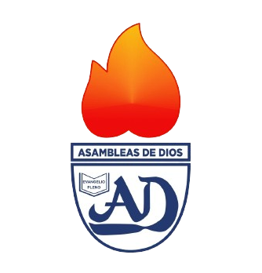

# HDM Huamanga



## 📋 Descripción

Sitio web oficial de Hijos De Ministros (HDM) de la Región Huamanga, desarrollado con React, TypeScript y Vite. Este proyecto tiene como objetivo apoyar a las familias de Las Asambleas de Dios del Perú región Huamanga, centrándose en los niños y adolescentes.

## ✨ Características principales

- **Diseño responsivo** adaptado para todo tipo de dispositivos
- **Secciones interactivas** para eventos, historia, galería y más
- **Integración con redes sociales** mediante componentes embebidos
- **Animaciones fluidas** para una experiencia de usuario mejorada
- **Formularios de contacto** para inscripciones a eventos

## 🚀 Tecnologías utilizadas

- **React 18+** - Biblioteca para crear interfaces de usuario
- **TypeScript** - Tipado estático para JavaScript
- **Vite** - Entorno de desarrollo ultrarrápido
- **Tailwind CSS** - Framework CSS utilitario
- **Framer Motion** - Biblioteca de animaciones para React

## 📦 Estructura del proyecto

```
hdm-react/
├── public/            # Recursos estáticos (imágenes, videos, etc.)
├── src/
│   ├── components/    # Componentes reutilizables
│   ├── pages/         # Páginas principales
│   ├── assets/        # Recursos del proyecto
│   ├── App.tsx        # Componente principal
│   └── main.tsx       # Punto de entrada
├── package.json       # Dependencias y scripts
└── tsconfig.json      # Configuración de TypeScript
```

## 🛠️ Instalación

1. Clona el repositorio:
   ```bash
   git clone https://github.com/percyby2000/HDM-Huamanga.git
   cd HDM-Huamanga
   ```

2. Instala las dependencias:
   ```bash
   npm install
   ```

3. Inicia el servidor de desarrollo:
   ```bash
   npm run dev
   ```

4. Abre [http://localhost:5173](http://localhost:5173) para ver la aplicación en tu navegador.

## 🔄 Despliegue

Para construir la aplicación para producción:

```bash
npm run build
```

Los archivos generados estarán en la carpeta `dist/` listos para ser desplegados.

## 👥 Contribución

Las contribuciones son bienvenidas. Si deseas colaborar:

1. Haz fork del proyecto
2. Crea una nueva rama (`git checkout -b feature/nueva-funcionalidad`)
3. Realiza tus cambios
4. Haz commit de tus cambios (`git commit -m 'Añade nueva funcionalidad'`)
5. Haz push a la rama (`git push origin feature/nueva-funcionalidad`)
6. Abre un Pull Request

## 📄 Licencia

Este proyecto está licenciado bajo la Licencia MIT - consulta el archivo LICENSE para más detalles.

## 📞 Contacto

Para más información sobre HDM Región Huamanga o este proyecto, puedes contactarnos a través de:

- 📧 Email: [hdm@asambleas.pe](mailto:hdm@asambleas.pe)
- 🌐 Web: [www.asambleasdedios.pe](https://www.asambleasdedios.pe)
- 📱 Facebook: [HDM Región Huamanga](https://www.facebook.com/hdmhuamanga)
```
# HDM-Huamanga
